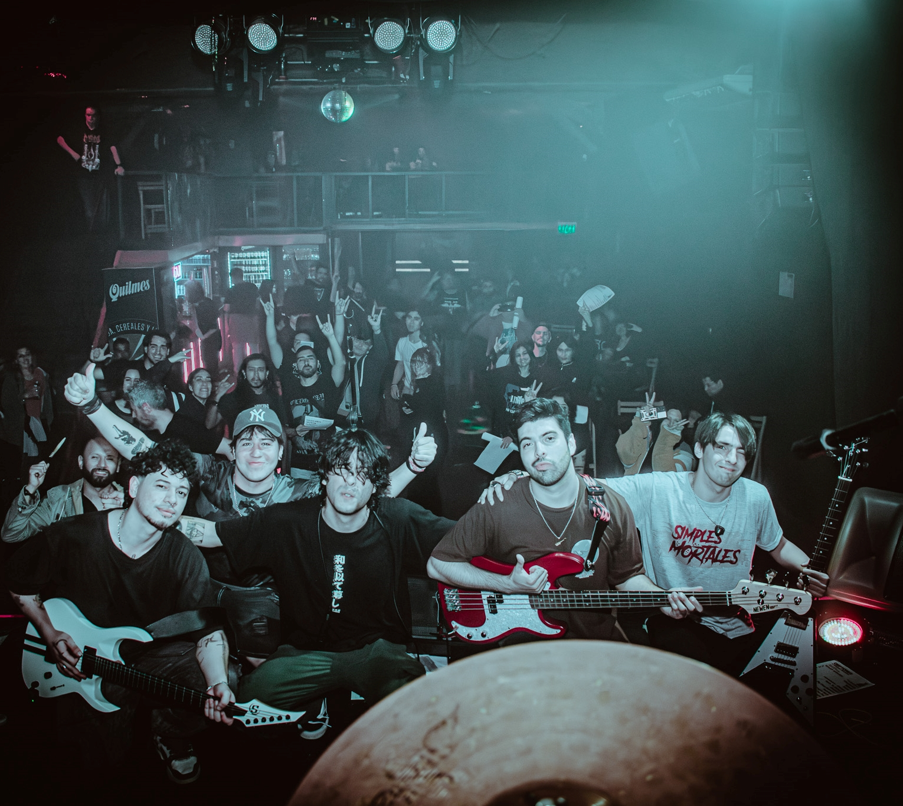

# 🎸 App Web Oficial - Simples Mortales

Bienvenidos al sitio oficial de **Simples Mortales**, la banda argentina de nu metal que rinde tributo a una de las leyendas del rock alternativo: **Deftones**. Aquí podrás encontrar toda la información sobre la banda, sus shows, música y contenido exclusivo, además de disfrutar de una experiencia web interactiva y visualmente impactante.

---

## 🎤 Sobre Simples Mortales y Deftones

**Simples Mortales** nace en Buenos Aires con la pasión de revivir y homenajear la esencia única de **Deftones**, una banda icónica que marcó un antes y un después en el nu metal y el rock alternativo desde los años 90. Con un sonido potente, atmosférico y emocional, Deftones ha influenciado a generaciones enteras y Simples Mortales busca llevar esa energía a cada escenario con autenticidad y respeto.

> *"Deftones no es solo una banda, es una experiencia sonora que mezcla agresividad y belleza, y Simples Mortales la trae viva para todos sus fans en Argentina."*

---

## 🚀 Características del Sitio Web

- **Experiencia 3D Interactiva:** Modelos y escenas en 3D creados con **React Three Fiber** para que puedas explorar visualmente elementos icónicos de la banda, como la pua personalizada.
- **Animaciones fluidas:** Transiciones y efectos con **Framer Motion** para una navegación dinámica y atractiva.
- **Efectos de Partículas:** Fondos animados con **tsParticles** que aportan movimiento y energía al diseño.
- **Diseño Responsivo:** Adaptado para verse perfecto en móviles, tablets y desktops gracias a **Tailwind CSS**.
- **Código robusto y escalable:** Desarrollado con **TypeScript** para máxima seguridad y mantenibilidad.

---

## 🛠️ Stack Tecnológico

| Función                  | Tecnología                                                                                          |
| ------------------------ | --------------------------------------------------------------------------------------------------- |
| **Framework Principal**  | [React 19](https://react.dev/)                                                                      |
| **Lenguaje**             | [TypeScript](https://www.typescriptlang.org/)                                                       |
| **Build Tool**           | [Vite](https://vitejs.dev/)                                                                         |
| **Estilos CSS**          | [Tailwind CSS](https://tailwindcss.com/)                                                            |
| **Routing**              | [React Router DOM](https://reactrouter.com/)                                                        |
| **Gráficos 3D**          | [Three.js](https://threejs.org/), [React Three Fiber](https://docs.pmnd.rs/react-three-fiber/getting-started/introduction) |
| **Animaciones**          | [Framer Motion](https://www.framer.com/motion/)                                                     |
| **Efectos de Partículas**| [tsParticles](https://particles.js.org/)                                                            |
| **Iconos**               | [Lucide React](https://lucide.dev/)                                                                 |
| **Calidad de Código**    | [ESLint](https://eslint.org/)                                                                       |

---

## ❤️ Sobre el proyecto y agradecimientos

Este proyecto está hecho con pasión por la música y la cultura nu metal, especialmente inspirado en la fuerza y creatividad de **Deftones**. Gracias a todos los fans y colaboradores que hacen posible que **Simples Mortales** siga creciendo.

---

## 📱 Síguenos en redes sociales

- Instagram: [@simples.mortales.band](https://www.instagram.com/simples.mortales.band/)
- Próximos shows y novedades en nuestras redes oficiales.

---

Creado con ❤️ desde Buenos Aires, Argentina, para todos los amantes del nu metal y Deftones.

---

*¡Vamos Simples Mortales!*
